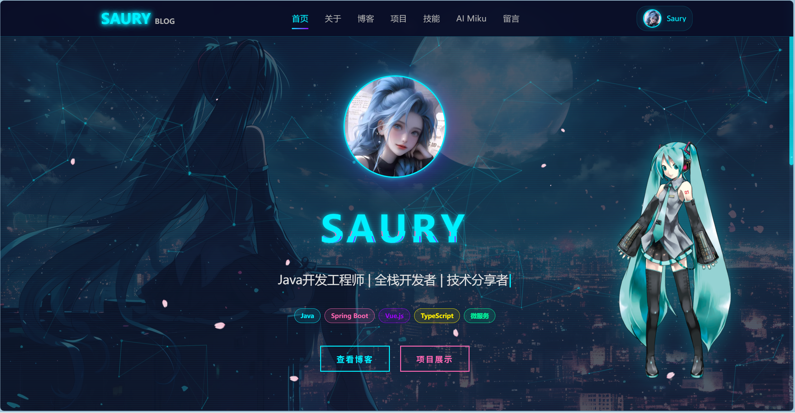
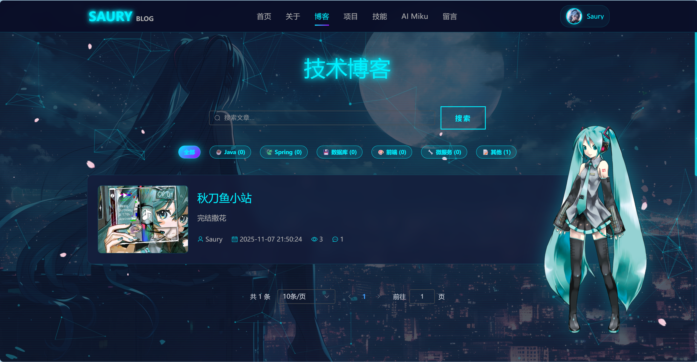
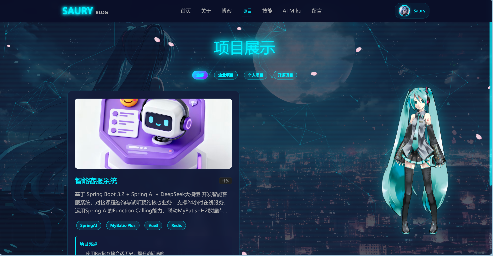
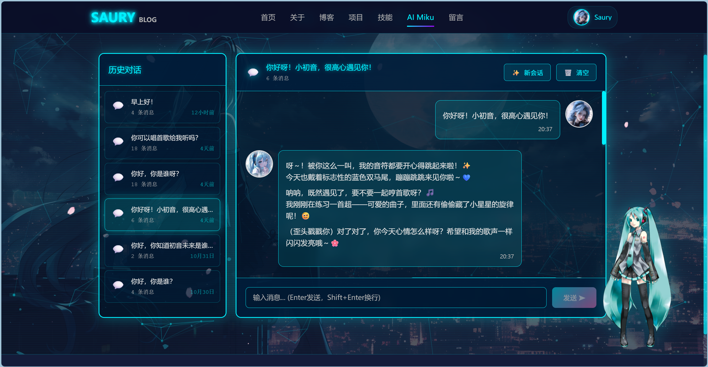
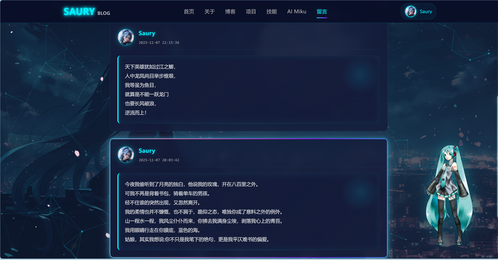

# 🚀 Saury Blog - 赛博朋克风格个人博客系统

<div align="center">


一个具有赛博朋克风格的现代化个人博客系统，支持文章管理、项目展示、AI 聊天、留言板等功能。

[在线演示](http://your-demo-url.com) · [问题反馈](https://github.com/IceSaury/SauryBlog/issues) · [功能建议](https://github.com/IceSaury/SauryBlog/issues)

</div>

---

## ✨ 项目特色

- 🎨 **赛博朋克设计风格** - 炫酷的霓虹灯效果和未来科技感
- 📝 **Markdown 编辑器** - 支持 Markdown 语法，实时预览
- 🤖 **AI 智能助手** - 集成 OpenAI，提供智能问答服务
- 💬 **评论互动系统** - 支持用户评论、回复、点赞
- 🎭 **Live2D 看板娘** - 可爱的动态角色陪伴
- 📊 **数据可视化** - ECharts 图表展示网站统计数据
- 🌸 **樱花特效** - 唯美的樱花飘落动画
- 📱 **响应式设计** - 完美适配各种设备
- 🔐 **JWT 认证** - 安全的用户认证机制
- ☁️ **阿里云 OSS** - 图片云存储服务

---

## 🎯 主要功能

### 前台功能

- **首页展示** - 个人信息展示、技术栈介绍、动态背景效果
- **博客文章** - 文章列表、详情、分类、标签筛选、搜索
- **项目展示** - 个人项目、技术栈、项目亮点展示
- **技能介绍** - 技术栈可视化展示
- **AI 聊天** - 智能 AI 助手对话功能
- **留言板** - 用户留言、互动交流
- **关于我** - 个人简介、联系方式
- **用户中心** - 个人资料管理、修改密码

### 后台功能

- **仪表盘** - 数据统计、访问量分析、趋势图表
- **文章管理** - 文章发布、编辑、删除、草稿箱
- **分类管理** - 分类添加、编辑、删除
- **标签管理** - 标签添加、编辑、删除
- **项目管理** - 项目添加、编辑、删除
- **评论管理** - 评论审核、删除
- **留言管理** - 留言审核、删除
- **网站配置** - 网站信息、SEO 设置
- **个人资料** - 修改昵称、头像、简介等

---

## 🛠️ 技术栈

### 后端技术

| 技术 | 版本 | 说明 |
|------|------|------|
| Spring Boot | 3.5.6 | 核心框架 |
| Java | 21 | 开发语言 |
| MyBatis Plus | 3.5.10.1 | ORM 框架 |
| MySQL | 8.0+ | 数据库 |
| Redis | 7.0+ | 缓存 |
| JWT | 0.12.6 | 认证授权 |
| Spring AI | 1.0.0-M6 | AI 集成 |
| Aliyun OSS | 3.18.1 | 对象存储 |
| Hutool | 5.8.34 | 工具类库 |
| FastJSON | 2.0.54 | JSON 处理 |

### 前端技术

| 技术 | 版本 | 说明 |
|------|------|------|
| Vue | 3.4.21 | 前端框架 |
| TypeScript | 5.4.3 | 开发语言 |
| Vite | 5.2.0 | 构建工具 |
| Element Plus | 2.6.3 | UI 组件库 |
| Vue Router | 4.3.0 | 路由管理 |
| Pinia | 2.1.7 | 状态管理 |
| Axios | 1.6.8 | HTTP 客户端 |
| ECharts | 6.0.0 | 数据可视化 |
| Marked | 12.0.1 | Markdown 解析 |
| Quill | 2.0.0 | 富文本编辑器 |
| GSAP | 3.12.5 | 动画库 |
| PixiJS | 6.5.10 | 2D 渲染引擎 |
| Live2D | 0.4.0 | 看板娘 |

---

## 📦 项目结构

```
SauryBlog/
├── backend/                 # 后端项目
│   ├── src/
│   │   ├── main/
│   │   │   ├── java/com/saury/blog/
│   │   │   │   ├── common/          # 通用类
│   │   │   │   ├── config/          # 配置类
│   │   │   │   ├── controller/      # 控制器
│   │   │   │   ├── dto/             # 数据传输对象
│   │   │   │   ├── entity/          # 实体类
│   │   │   │   ├── exception/       # 异常处理
│   │   │   │   ├── interceptor/     # 拦截器
│   │   │   │   ├── mapper/          # 数据访问层
│   │   │   │   ├── service/         # 业务逻辑层
│   │   │   │   ├── utils/           # 工具类
│   │   │   │   └── vo/              # 视图对象
│   │   │   └── resources/
│   │   │       ├── db/              # 数据库脚本
│   │   │       ├── application.yml  # 配置文件
│   │   │       └── logback-spring.xml
│   │   └── test/                    # 测试代码
│   └── pom.xml                      # Maven 配置
│
├── frontend/                # 前端项目
│   ├── src/
│   │   ├── api/             # API 接口
│   │   ├── assets/          # 静态资源
│   │   ├── components/      # 公共组件
│   │   ├── layouts/         # 布局组件
│   │   ├── router/          # 路由配置
│   │   ├── store/           # 状态管理
│   │   ├── styles/          # 样式文件
│   │   ├── types/           # TypeScript 类型
│   │   ├── utils/           # 工具函数
│   │   ├── views/           # 页面组件
│   │   ├── App.vue          # 根组件
│   │   └── main.ts          # 入口文件
│   ├── public/              # 公共资源
│   ├── index.html           # HTML 模板
│   ├── package.json         # 依赖配置
│   ├── tsconfig.json        # TS 配置
│   └── vite.config.ts       # Vite 配置
│
└── README.md                # 项目说明
```

---

## 🚀 快速开始

### 环境要求

- JDK 21+
- Node.js 18+
- MySQL 8.0+
- Redis 7.0+
- Maven 3.8+

### 后端部署

1. **克隆项目**

```bash
git clone https://github.com/yourusername/SauryBlog.git
cd SauryBlog/backend
```

2. **创建数据库**

```bash
# 登录 MySQL
mysql -u root -p

# 执行数据库脚本
source src/main/resources/db/schema.sql
```

3. **配置文件**

复制配置文件并修改数据库连接等信息：

```bash
cp src/main/resources/application-dev.yml.example src/main/resources/application-dev.yml
```

编辑 `application-dev.yml`，配置以下内容：

```yaml
# 数据库配置
spring:
  datasource:
    url: jdbc:mysql://localhost:3306/saury_blog
    username: your_username
    password: your_password
  
  # Redis 配置
  data:
    redis:
      host: localhost
      port: 6379
      password: your_redis_password

# JWT 配置
jwt:
  secret: your_jwt_secret_key
  expire: 604800

# 阿里云 OSS 配置（可选）
aliyun:
  oss:
    endpoint: your_oss_endpoint
    access-key-id: your_access_key_id
    access-key-secret: your_access_key_secret
    bucket-name: your_bucket_name

# OpenAI 配置（可选）
spring:
  ai:
    openai:
      api-key: your_openai_api_key
      base-url: https://api.openai.com
```

4. **启动后端**

```bash
# 使用 Maven 启动
mvn spring-boot:run

# 或者打包后运行
mvn clean package
java -jar target/saury-blog-1.0.0.jar
```

后端服务默认运行在 `http://localhost:8080`

### 前端部署

1. **进入前端目录**

```bash
cd ../frontend
```

2. **安装依赖**

```bash
npm install
```

3. **配置后端地址**

编辑 `src/utils/request.ts`，修改后端 API 地址：

```typescript
const service = axios.create({
  baseURL: 'http://localhost:8080/api', // 后端地址
  timeout: 10000
})
```

4. **启动开发服务器**

```bash
npm run dev
```

前端服务默认运行在 `http://localhost:5173`

5. **构建生产版本**

```bash
npm run build
```

构建完成后，将 `dist` 目录部署到 Web 服务器即可。

---

## 🔑 默认账号

- **管理员账号**: `admin`
- **默认密码**: `123456`

> ⚠️ 首次登录后请及时修改密码！

---

## 📝 接口文档

详细的 API 接口文档请查看：[API.md](./API.md)

---

## 📸 项目截图

### 前台页面

| 首页 | 博客列表 |
|------|---------|
|  |  |

| 文章详情 | 项目展示 |
|---------|---------|
|  |  |

| AI 聊天 | 留言板 |
|---------|--------|
|  |  |

### 后台页面

| 仪表盘 | 文章管理 |
|--------|---------|
|  |  |

---

## 🗺️ 开发路线图

- [x] 基础功能开发
  - [x] 用户认证与授权
  - [x] 文章 CRUD
  - [x] 分类标签管理
  - [x] 评论系统
  - [x] 留言板
- [x] 高级功能
  - [x] AI 智能助手
  - [x] 图片上传（OSS）
  - [x] 数据统计
  - [x] Live2D 看板娘
- [ ] 功能优化
  - [ ] 文章搜索优化
  - [ ] SEO 优化
  - [ ] 性能优化
  - [ ] 移动端适配优化
- [ ] 新功能计划
  - [ ] 邮件通知
  - [ ] 文章点赞收藏
  - [ ] 用户关注
  - [ ] RSS 订阅
  - [ ] 站点地图

---

## 🤝 贡献指南

欢迎提交 Issue 和 Pull Request！

1. Fork 本仓库
2. 创建特性分支 (`git checkout -b feature/AmazingFeature`)
3. 提交更改 (`git commit -m 'Add some AmazingFeature'`)
4. 推送到分支 (`git push origin feature/AmazingFeature`)
5. 提交 Pull Request

---

## 📄 开源协议

本项目采用 [MIT](LICENSE) 协议开源。

---

## 💬 联系方式

如有问题或建议，欢迎通过以下方式联系我：

- 📧 Email: 3254905724@qq.com
- 🐙 GitHub: [@IceSaury](https://github.com/IceSaury)

---

## 🙏 致谢

感谢以下优秀的开源项目：

- [Spring Boot](https://spring.io/projects/spring-boot)
- [Vue.js](https://vuejs.org/)
- [Element Plus](https://element-plus.org/)
- [MyBatis Plus](https://baomidou.com/)
- [Live2D](https://www.live2d.com/)

---

<div align="center">

**Made with ❤️ by Saury**

</div>
